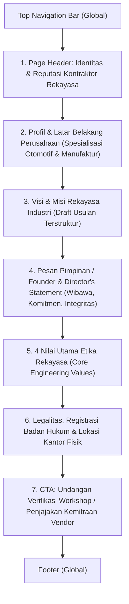

# Rencana Konten & Struktur Halaman Tentang Kami (About Us)
**PT. Aris Teknindo Mandiri (ATM)**  
*Dokumen Blueprint: Institutional Credibility & Corporate Profile*  
*Lokasi Dokumen: `planning/about-content.md`*

---

## 1. Ikhtisar Halaman (Page Overview & Purpose)

Halaman **About Us** memiliki fungsi strategis yang berbeda dari Halaman Beranda. Jika Beranda berfungsi sebagai *alat penangkap kebutuhan teknis cepat*, maka halaman Tentang Kami dirancang untuk **Audit Kualifikasi Vendor (*Vendor Assessment / Legal Qualification*)**:

* **Target Pengunjung**: Procurement / Purchasing Senior, Vendor Management Auditor, Kepala Departemen Engineering, dan Manajemen Pabrik yang ingin memverifikasi:
  1. *Apakah PT ini berbadan hukum sah dan bereputasi resmi?*
  2. *Siapa figur pimpinan penanggung jawab yang berintegritas di balik perusahaan?*
  3. *Apa komitmen jangka panjang, visi, misi, dan nilai kerja yang mereka bawa?*
  4. *Di mana lokasi kantor dan workshop fisiknya?*
* **Tone of Voice**: Formal korporat, berwibawa (*authoritative*), transparan, dan berlandaskan etika rekayasa industri (*engineering integrity*).
* **Nuansa Visual**: *Dark Industrial Elegance* — Latar gelap pekat (`#0B0F17` dan `#111724`) dipadukan dengan tipografi putih tegas, aksen merah ATM (`#DC2626`), serta foto potret eksekutif dan dokumentasi fasilitas fisik.

---

## 2. Alur Narasi Halaman About (The Corporate Narrative)



---

## 3. Visual Layout Blueprint (Wireframe Kasar Antarmuka)

### 3.1 Sketsa Kasar Desktop (Desktop Macro Wireframe)

```text
┌────────────────────────────────────────────────────────────────────────────────────────────────────────┐
│  [LOGO ATM]    Beranda   [Tentang Kami]   Layanan & Fasilitas   Pengalaman Kerja   Kontak   │ [ID|EN]  │
├────────────────────────────────────────────────────────────────────────────────────────────────────────┤
│                                                                                                        │
│  HEADER BANNER: TENTANG PT. ARIS TEKNINDO MANDIRI                                                      │
│  Badge: Profil Korporat & Landasan Rekayasa                                                            │
│  H1: Dedikasi Presisi & Rekayasa Terpercaya untuk Industri Indonesia                                   │
│  Sub: Menjadi mitra strategis industri manufaktur dan otomotif melalui keahlian mekanikal,            │
│       elektrikal, machining presisi, dan otomasi PLC terintegrasi.                                     │
│                                                                                                        │
├────────────────────────────────────────────────────────────────────────────────────────────────────────┤
│                                                                                                        │
│  SECTION 1: LATAR BELAKANG & POSISI PERUSAHAAN (COMPANY IDENTITY & CONTEXT)                           │
│  ┌───────────────────────────────────────────────┐ ┌────────────────────────────────────────────────┐  │
│  │  H2: Lahir dari Kebutuhan Riil Pabrik         │ │  [ FOTO / DOKUMENTASI AREA KERJA TEKNIS ]      │  │
│  │      akan Solusi yang Cepat dan Presisi       │ │  Foto sudut workshop Babelan atau teknisi yang │  │
│  │                                               │ │  sedang menginspeksi panel kontrol industri    │  │
│  │  PT. Aris Teknindo Mandiri berpusat di Bekasi,│ │  dengan seragam resmi berlogo ATM.             │  │
│  │  Jawa Barat. Kami bergerak di bidang          │ │                                                │  │
│  │  pengadaan barang dan jasa rekayasa industri, │ │  Keterangan Foto:                              │  │
│  │  khususnya sektor otomotif.                   │ │  Aktivitas perakitan dan kontrol kualitas di   │  │
│  │                                               │ │  fasilitas workshop Babelan, Bekasi.           │  │
│  │  Pengalaman lapangan bertahun-tahun membuktikan│ │                                                │  │
│  │  bahwa kami mampu menjawab dua kebutuhan kunci│ │                                                │  │
│  │  sekaligus: kekuatan fisik logam (machining)  │ │                                                │  │
│  │  dan kecerdasan sistem logika (PLC otomasi).  │ │                                                │  │
│  └───────────────────────────────────────────────┘ └────────────────────────────────────────────────┘  │
│                                                                                                        │
├────────────────────────────────────────────────────────────────────────────────────────────────────────┤
│                                                                                                        │
│  SECTION 2: VISI & MISI PERUSAHAAN (ENGINEERING VISION & MISSION)                                      │
│  ┌──────────────────────────────────────────────────────────────────────────────────────────────────┐  │
│  │  KOTAK VISI PERUSAHAAN                                                                           │  │
│  │  "Menjadi mitra kontraktor otomasi, mekanikal, dan permesinan presisi terdepan di Indonesia      │  │
│  │   yang diandalkan oleh industri manufaktur dan otomotif atas kecepatan solusi dan kualitas."     │  │
│  └──────────────────────────────────────────────────────────────────────────────────────────────────┘  │
│  ┌──────────────────────────────┬──────────────────────────────┬─────────────────────────────────────┐ │
│  │ MISI 1: PRESEISI & MUTU      │ MISI 2: KEANDALAN LINI PABRIK│ MISI 3: KEMITRAAN JANGKA PANJANG    │ │
│  │ Menghasilkan suku cadang     │ Memberikan penanganan        │ Membangun kerja sama transparan,    │ │
│  │ presisi tinggi sesuai standar│ kelistrikan & otomasi PLC    │ akuntabel, dan berlandaskan saling  │ │
│  │ teknis dan toleransi ketat.  │ tanggap untuk cegah downtime.│ percaya dengan seluruh prinsipal.   │ │
│  └──────────────────────────────┴──────────────────────────────┴─────────────────────────────────────┘ │
│                                                                                                        │
├────────────────────────────────────────────────────────────────────────────────────────────────────────┤
│                                                                                                        │
│  SECTION 3: PESAN PIMPINAN (FOUNDER & DIRECTOR'S COMMITMENT)                                           │
│  ┌───────────────────────────────────────────────┐ ┌────────────────────────────────────────────────┐  │
│  │  [ FOTO POTRET EKSEKUTIF DIREKTUR / OWNER ]   │ │  KOMITMEN MANAJEMEN & PIMPINAN PERUSAHAAN      │  │
│  │  - Potret berwibawa, pakaian rapi / jas kerja │ │  H2: Integritas dan Tanggung Jawab Teknis      │  │
│  │  - Pose profesional berlatar workshop/mesin   │ │      Adalah Landasan Setiap Pekerjaan Kami     │  │
│  │  - Menghadirkan rasa hormat dan kepastian     │ │                                                │  │
│  │                                               │ │  "Ketika sebuah pabrik mempercayakan pekerjaan │  │
│  │  [Badge: Kepemimpinan & Akuntabilitas]        │ │   kepada ATM—baik itu satu komponen shaft kecil│  │
│  │                                               │ │   maupun peremajaan total sistem PLC—mereka    │  │
│  │  Nama: [Menunggu Konfirmasi Klien]            │ │   sedang mempertaruhkan kelancaran produksinya.│  │
│  │  Jabatan: Direktur Utama / Founder            │ │   Tanggung jawab itu kami jawab dengan kontrol │  │
│  │  PT. Aris Teknindo Mandiri                    │ │   mutu tanpa kompromi dan komitmen jadwal."    │  │
│  └───────────────────────────────────────────────┘ └────────────────────────────────────────────────┘  │
│                                                                                                        │
├────────────────────────────────────────────────────────────────────────────────────────────────────────┤
│                                                                                                        │
│  SECTION 4: 4 NILAI UTAMA REKAYASA (CORE ENGINEERING VALUES)                                           │
│  ┌──────────────────────┬──────────────────────┬──────────────────────┬──────────────────────────────┐ │
│  │ 1. PRESTASI TEKNIS   │ 2. TANGGAP RESPON    │ 3. TRANSPARANSI      │ 4. FASILITAS MANDIRI         │ │
│  │ Bekerja berdasarkan  │ Memahami urgensi     │ Kejujuran spesifikasi│ Pekerjaan diproses di        │ │
│  │ kalkulasi drawing,   │ lini pabrik yang     │ material, sertifikasi│ fasilitas workshop sendiri   │ │
│  │ toleransi akurat, &  │ berhenti; respon cepat│ brand part impor asli│ di Babelan untuk kendali     │ │
│  │ kaidah engineering.  │ untuk troubleshooting│ tanpa manipulasi tier│ mutu & jadwal pengiriman.    │ │
│  └──────────────────────┴──────────────────────┴──────────────────────┴──────────────────────────────┘ │
│                                                                                                        │
├────────────────────────────────────────────────────────────────────────────────────────────────────────┤
│                                                                                                        │
│  SECTION 5: LEGALITAS USAHA & FASILITAS OPERASIONAL (VERIFIKASI VENDOR)                                │
│  ┌──────────────────────────────────────────────────┬────────────────────────────────────────────────┐ │
│  │ INFORMASI LEGALITAS RESMI BADAN HUKUM            │ KANTOR & WORKSHOP OPERASIONAL                  │ │
│  │ • Bentuk Usaha: Perseroan Terbatas (PT)          │ • Lokasi: Perum Pondok Permata C17/46, Babelan,│ │
│  │ • Nama Legal: PT. Aris Teknindo Mandiri          │   Bekasi – Jawa Barat, Indonesia               │ │
│  │ • No. Registrasi Kemenkumham/PT: 1280189         │ • Akses: Dekat kawasan industri Cikarang,      │ │
│  │ • Kategori: Mekanikal, Elektrikal, Kontraktor    │   MM2100, GIIC, KIIC & Jababeka                │ │
│  │ • Domain Resmi: www.aristeknindomandiri.com      │ • Operasional: Senin-Jumat 08.00-17.00 WIB     │ │
│  │ • Dokumen Legal Lengkap: Tersedia atas Permintaan│ • Kunjungan Survei / Audit: Terbuka            │ │
│  └──────────────────────────────────────────────────┴────────────────────────────────────────────────┘ │
│                                                                                                        │
├────────────────────────────────────────────────────────────────────────────────────────────────────────┤
│                                                                                                        │
│  SECTION 6: CALL-TO-ACTION KUALIFIKASI VENDOR                                                          │
│  ┌──────────────────────────────────────────────────────────────────────────────────────────────────┐  │
│  │ H2: Membutuhkan Berkas Legalitas atau Ingin Menjadwalkan Audit Fasilitas Workshop Kami?          │  │
│  │ Tim manajemen kami siap mengirimkan Company Profile resmi, daftar data teknis, atau menerima     │  │
│  │ kunjungan verifikasi lapangan dari tim Vendor Management pabrik Anda.                            │  │
│  │                                                                                                  │  │
│  │ [ TOMBOL MERAH: HUBUNGI KAMI UNTUK DOKUMEN VENDOR ]   [ TOMBOL OUTLINE: UNDUH PROFIL PDF (ATM) ] │  │
│  └──────────────────────────────────────────────────────────────────────────────────────────────────┘  │
│                                                                                                        │
├────────────────────────────────────────────────────────────────────────────────────────────────────────┤
│  GLOBAL FOOTER                                                                                         │
└────────────────────────────────────────────────────────────────────────────────────────────────────────┘
```

---

## 4. Rincian Konten, Copywriting & Panduan Aset Tiap Section

### Header Banner
* **Badge Kategori**: `PROFIL PERUSAHAAN & KREDIBILITAS KORPORAT`
* **Headline (H1)**:  
  **Dedikasi Presisi & Rekayasa Terpercaya untuk Kelancaran Industri Indonesia**
* **Sub-headline**:  
  PT. Aris Teknindo Mandiri adalah kontraktor mekanikal-elektrikal dan permesinan presisi berbadan hukum resmi, siap menjadi mitra strategis pabrik manufaktur dan otomotif Anda.

---

### Section 1: Landasan Pendirian & Pengenalan Bisnis

* **Tujuan**: Menjelaskan konteks pendirian dan posisi ATM di mata industri.
* **Layout**: Dua Kolom (Teks penjelasan di kiri, Foto dokumentasi area kerja di kanan).
* **Copywriting**:
  * **Judul (H2)**: **Solusi Nyata di Titik Pertemuan Antara Kekuatan Mekanikal dan Kecerdasan Otomasi**
  * **Paragraf 1**: Berakar di Bekasi, Jawa Barat—jantung kawasan manufaktur terbesar di Indonesia—PT. Aris Teknindo Mandiri didirikan untuk menjembatani kesenjangan yang sering dihadapi pabrik: kebutuhan akan vendor yang tidak hanya mengerti logika pemrograman kontrol kelistrikan, tetapi juga memiliki kemampuan manufaktur fisik untuk membuat komponen logam presisi di bengkel sendiri.
  * **Paragraf 2**: Kami berpengalaman mendukung kelancaran operasional berbagai pabrik industri, khususnya di sektor otomotif. Portofolio kerja sama yang telah kami bangun menjadi bukti nyata dedikasi kami dalam menghadirkan suku cadang tahan lama, instalasi rapi berstandar keselamatan, dan sistem otomasi berbasis PLC yang andal.

---

### Section 2: Visi & Misi Perusahaan (Engineering-Focused)

> [!NOTE]
> Pada Company Profile PDF asli, poin Visi & Misi belum tertulis secara eksplisit. Berikut adalah **rumusan usulan terstruktur (developer draft proposal)** yang dirancang selaras dengan karakter bisnis ATM untuk disetujui oleh klien.

#### Visi Perusahaan:
> *"Menjadi perusahaan kontraktor rekayasa mekanikal, elektrikal, dan permesinan presisi terdepan di Indonesia yang dipercaya oleh industri manufaktur dan otomotif atas keunggulan mutu teknis, kecepatan penanganan, dan integritas kemitraan."*

#### 3 Misi Utama:
1. **Presisi Tanpa Kompromi (*Precision First*)**:  
   Memproduksi komponen permesinan (*machining*) dan fabrikasi dengan toleransi ukuran yang ketat sesuai spesifikasi gambar teknik (*engineering drawing*) guna menjamin durabilitas di lini produksi.
2. **Keandalan Operasional Pabrik (*Zero Downtime Orientation*)**:  
   Menyediakan jasa instalasi kelistrikan berstandar tinggi, pemrograman otomasi PLC yang teruji, serta layanan *troubleshooting* tanggap guna meminimalisasi waktu henti mesin klien.
3. **Integritas Rantai Pasok (*Authentic Supply Chain*)**:  
   Menyediakan pengadaan suku cadang industri impor berkualitas tinggi dari prinsipal global terverifikasi dengan kepastian spesifikasi dan harga yang transparan.

---

### Section 3: Komitmen Pimpinan (Founder & Director's Statement)

* **Tujuan**: Menghadirkan wajah kepemimpinan, kepastian tanggung jawab korporat, dan wibawa hukum perusahaan (dipindahkan dari Beranda sesuai arahan Anda).
* **Layout**: Dua Kolom (Foto potret pimpinan di kiri, Pernyataan komitmen di kanan).

#### Panduan Visual Foto Pimpinan:
* **Pose**: Berdiri tegap berwibawa, pakaian kemeja kerja rapi berblazer atau seragam dinas teknis, ekspresi ramah namun tegas dan berkarakter pemimpin.
* **Latar Belakang**: Area workshop bersih dengan pencahayaan hangat berlatar mesin CNC/bubut yang rapi.
* **Status**: *Menunggu konfirmasi nama resmi dan file foto dari klien (sementara waktu dapat menggunakan siluet placeholder eksekutif).*

#### Copywriting Pernyataan Pimpinan:
* **Sub-label**: `PESAN DIREKTUR UTAMA`
* **Judul (H2)**: **Kepercayaan Anda Adalah Tanggung Jawab Tertinggi Kami**
* **Kutipan Komitmen**:
  > *"Bagi kami di PT. Aris Teknindo Mandiri, bisnis rekayasa industri adalah bisnis kepercayaan jangka panjang. Ketika sebuah pabrik menghubungi kami—baik untuk membubut satu poros darurat, menarik ratusan meter kabel tray, hingga merancang sistem otomasi PLC pabrik—kami sadar bahwa kelancaran produksi dan keselamatan kerja mereka ada di tangan kami.*  
  >  
  > *Oleh karena itu, kami tidak pernah mengambil jalan pintas. Setiap milimeter toleransi logam kami ukur dengan teliti, setiap baris kode PLC kami uji fungsionalitasnya, dan setiap janji tenggat waktu kami pegang teguh. Kami hadir bukan sekadar sebagai vendor, melainkan mitra teknik yang siap berdiri di samping Anda saat lini produksi membutuhkan solusi."*
* **Tanda Tangan & Jabatan**:  
  **Direksi PT. Aris Teknindo Mandiri**  
  *Bekasi, Jawa Barat*

---

### Section 4: 4 Nilai Utama Etika Rekayasa (Core Values)

Bukan nilai klise seperti "Jujur dan Ramah", melainkan nilai operasional industri:

1. **Presisi Teknis (*Engineering Precision*)**  
   Bekerja berlandaskan data teknis, kalkulasi material yang tepat, dan toleransi mikrometer yang dapat dipertanggungjawabkan.
2. **Respon Cepat (*Rapid Operational Response*)**  
   Memahami bahwa setiap menit lini produksi berhenti adalah kerugian biaya. Tim kami siap bertindak tanggap untuk kebutuhan darurat.
3. **Transparansi Spesifikasi (*Authenticity & Clarity*)**  
   Kejujuran penuh dalam pemilihan mutu material, merek komponen impor yang disuplai, dan rincian penawaran biaya tanpa biaya tersembunyi.
4. **Kepemilikan Fasilitas Mandiri (*Direct Execution*)**  
   Didukung workshop fisik sendiri di Babelan, Bekasi (mesin bubut, milling, CNC, dan area panel) sehingga kualitas pengerjaan dan waktu pengiriman berada dalam kendali langsung kami.

---

### Section 5: Legalitas & Kepatuhan Badan Hukum

* **Tujuan**: Memenuhi syarat administrasi tim Procurement dan Legal pabrik rekanan.
* **Konten Tabel Legalitas**:
  * **Nama Resmi**: PT. Aris Teknindo Mandiri
  * **Bentuk Badan Hukum**: Perseroan Terbatas (PT) Sah
  * **Nomor Registrasi PT**: `1280189`
  * **Alamat Terdaftar**: Perum Pondok Permata C17/46, Babelan, Bekasi – Jawa Barat
  * **Kategori KBLI / Klasifikasi**: Mekanikal & Elektrikal Kontraktor, Fabrikasi Logam, Jasa Permesinan, Perdagangan Besar Suku Cadang Industri
  * **Rekening Bank Perusahaan**: Atas nama PT. Aris Teknindo Mandiri *(Diberikan pada invoice resmi)*
  * **Catatan Audit Vendor**: Dokumen legalitas pendukung (NIB, NPWP Perusahaan, Akta Notaris) siap dilampirkan dalam format berkas kualifikasi rekanan.

---

### Section 6: Actionable CTA — Verifikasi Vendor

* **Tujuan**: Mendorong tindakan konversi spesifik bagi calon klien korporat.
* **Headline**: **Sedang Membuka Pendaftaran Vendor Baru atau Ingin Mengaudit Fasilitas Workshop Kami?**
* **Deskripsi**: Kami menyambut baik kunjungan survei tim teknis dan procurement pabrik Anda ke workshop kami di Babelan, Bekasi, serta siap melengkapi seluruh formulir registrasi vendor (*vendor registration pack*).
* **Tombol Interaksi**:
  * Tombol 1: `[Minta Berkas Legalitas & Formulir Rekanan]` → Menghubungkan ke admin legal via email/form.
  * Tombol 2: `[Jadwalkan Kunjungan ke Workshop (WhatsApp)]` → Langsung koordinasi jadwal temu survei fisik.

---

## 5. Checklist Kebutuhan Data dari Klien untuk Halaman About

Sebelum publikasi final, data berikut perlu dikonfirmasi oleh pemilik perusahaan:
1. **Nama & Gelar Resmi Direktur Utama**: Untuk dicantumkan di bawah foto dan pesan pimpinan.
2. **Foto Potret Resmi Direktur**: File foto resolusi tinggi untuk section pesan pimpinan.
3. **Persetujuan Teks Visi & Misi**: Apakah rumusan usulan 3 misi di atas sudah disetujui atau ada poin khusus dari pemilik.
4. **Daftar Dokumen Legal yang Boleh Ditampilkan**: Konfirmasi apakah nomor NPWP dan NIB perusahaan ingin dicantumkan terbuka di web atau hanya diberikan atas permintaan (*by request*).
