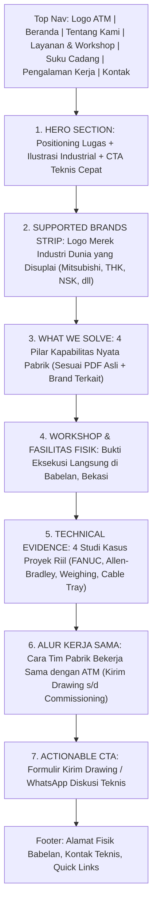

# Rencana Konten & Struktur Halaman Beranda (Home Page)
**PT. Aris Teknindo Mandiri (ATM)**  
*Dokumen Blueprint: Technical B2B Engineering Architecture (Enriched with Authentic Brands)*  
*Lokasi Dokumen: `planning/home-content.md`*

---

## 1. Filosofi & Arah Perubahan (Rombak & Penyempurnaan)

Berdasarkan evaluasi terhadap pola website *industrial B2B* murni, halaman beranda ATM **tidak lagi menggunakan format "template company profile" konvensional** yang pasif. 

### Perubahan Mendasar:
1. **Pusat Gravitasi adalah Kemampuan Eksekusi Teknis**: Pengunjung (Plant Manager, Maintenance Lead, Purchasing Pabrik) langsung disuguhi jawaban atas apa yang bisa dikerjakan ATM, bukti kepemilikan mesin workshop sendiri, dan rekam jejak penyelesaian masalah fisik di lapangan.
2. **Owner / Direktur Dialihkan ke Halaman About**: Menghilangkan profil personal dari Home Page. Kredibilitas di Home murni dibangun dari bukti fisik: mesin bubut/milling/CNC, panel kontrol, dan servo motor nyata.
3. **Penyelarasan Hero Visual (Ilustrasi Industrial Modern)**: Menggunakan ilustrasi bergaya *industrial engineering schematic/vector* untuk Hero fold sebagai solusi cerdas mengatasi keterbatasan stok foto resolusi tinggi wide-banner, sekaligus membangun karakter teknis yang rapi dan futuristik.
4. **Restorasi 4 Taksonomi Bisnis Asli**: Kembali utuh ke 4 pilar dokumen resmi ATM: *(1) Otomasi & Kontraktor PLC, (2) Fabrikasi & Machining Presisi, (3) Fabrikasi Mesin & Konstruksi Sistem, (4) Pengadaan Part Impor on-Demand*.
5. **Dukungan 29 Brand Industri Global Resmi**: Memasukkan daftar 29 merek tier-1 dunia yang berhasil diekstrak dari gambar Halaman 3 PDF asli (Mitsubishi, Yaskawa, THK, NSK, Timken, Tsubaki, Cognex, dll.) sebagai strip kredibilitas instan untuk tim *purchasing* dan *maintenance*.
6. **Project sebagai "Technical Evidence"**: Bukan sekadar galeri kartu foto, melainkan studi kasus mini yang menjelaskan sistem, platform merek (FANUC, Allen-Bradley), dan lingkup penanganannya.

---

## 2. Alur Narasi Halaman Beranda (The Engineering Narrative)



---

## 3. Visual Layout Blueprint (Wireframe Kasar Antarmuka)

### 3.1 Sketsa Kasar Desktop (Desktop Macro Wireframe)

```text
┌────────────────────────────────────────────────────────────────────────────────────────────────────────┐
│  [LOGO ATM]    Beranda   Tentang Kami   Layanan & Fasilitas   Pengalaman Kerja   Kontak   │ [WA Langsung]│
├────────────────────────────────────────────────────────────────────────────────────────────────────────┤
│                                                                                                        │
│  SECTION 1: HERO (POSISI TEKNIS & SOLUSI CEPAT)                                                        │
│  ┌───────────────────────────────────────────────┐ ┌────────────────────────────────────────────────┐  │
│  │ Badge: Kontraktor Otomasi PLC & Workshop Bekasi│ │  [ ILUSTRASI VEKTOR INDUSTRIAL MODERN ]       │  │
│  │                                               │ │  - Visual skematik jalur konveyor otomatis     │  │
│  │ H1: Rekayasa Mekanikal, Fabrikasi Presisi     │ │  - Terminal kontrol HMI & diagram ladder PLC   │  │
│  │     & Kontraktor Otomasi PLC Pabrik           │ │  - Elemen part presisi (gears & shaft)         │  │
│  │                                               │ │  - Palet warna: Dark Slate + Garis Merah ATM   │  │
│  │ Mendukung operasional industri manufaktur &   │ │                                                │  │
│  │ otomotif melalui pembuatan spare part kustom, │ │  *Solusi visual rapi pengganti keterbatasan    │  │
│  │ instalasi kelistrikan, hingga start-up sistem.│ │   foto landscape resolusi tinggi.              │  │
│  │                                               │ │                                                │  │
│  │ [ Tombol: Kirim Drawing / Minta Penawaran ]   │ │                                                │  │
│  │ [ Tombol WA: Hubungi Tim Lapangan ]           │ │                                                │  │
│  └───────────────────────────────────────────────┘ └────────────────────────────────────────────────┘  │
│                                                                                                        │
├────────────────────────────────────────────────────────────────────────────────────────────────────────┤
│  SECTION 2: SUPPORTED GLOBAL INDUSTRIAL BRANDS (TICKER / LOGO STRIP MONOKROM)                          │
│  "Akses Rantai Pasok Langsung untuk Komponen Otomasi & Mekanikal Standar Internasional"                │
│  ┌──────────────────────────────────────────────────────────────────────────────────────────────────┐  │
│  │ [MITSUBISHI] • [YASKAWA] • [THK] • [HIWIN] • [NSK] • [TIMKEN] • [TSUBAKI] • [COGNEX] • [AUTONICS] │  │
│  └──────────────────────────────────────────────────────────────────────────────────────────────────┘  │
├────────────────────────────────────────────────────────────────────────────────────────────────────────┤
│  SECTION 3: SOLUSI REKAYASA & KEBUTUHAN PABRIK (INTERACTIVE SPLIT STAGE)                               │
│  "Pilih kapabilitas untuk melihat bagaimana kami mendukung lini produksi Anda"                         │
│  ┌──────────────────────────┬────────────────────────────────────────────────────────────────────────┐ │
│  │ DAFTAR PILAR (KLIK/HOVER)│ PANGGUNG VISUAL LAYANAN AKTIF (Contoh: Tab 2 Machining Presisi)        │ │
│  │                          │ ┌───────────────────────────────┬────────────────────────────────────┐ │ │
│  │ 01. Otomasi & Kontraktor │ │ [ VISUAL TEKNIS / DIAGRAM ]   │ H3: Machining Spare Part Presisi   │ │ │
│  │     PLC Industri         │ │ Foto komponen part logam      │     Tanpa Inden OEM yang Lama      │ │ │
│  │                          │ │ presisi hasil bubut/CNC       │                                    │ │ │
│  │ [02. Fabrikasi &         │ │ (poros, sprocket, flange, pin)│ Masalah: Part mesin impor aus/rusak│ │ │
│  │      Machining Presisi]  │ │ berlatar gelap bersih.        │ dan inden ke OEM terlalu lama.     │ │ │
│  │      <-- (AKTIF MERAH)   │ │                               │                                    │ │ │
│  │                          │ │                               │ Solusi: Diproduksi di workshop ATM │ │ │
│  │ 03. Fabrikasi Mesin &    │ │                               │ Babelan via Bubut & CNC toleransi  │ │ │
│  │     Sistem Konveyor      │ │                               │ presisi sesuai drawing CAD/sampel. │ │ │
│  │                          │ │                               │                                    │ │ │
│  │ 04. Pengadaan Komponen   │ │                               │ [ Pelajari Detail Machining → ]    │ │ │
│  │     Impor on-Demand      │ │                               │                                    │ │ │
│  └──────────────────────────┴─┴───────────────────────────────┴────────────────────────────────────┴─┘ │
│                                                                                                        │
├────────────────────────────────────────────────────────────────────────────────────────────────────────┤
│                                                                                                        │
│  SECTION 4: BUKTI KAPASITAS FISIK (FASILITAS WORKSHOP BABELAN, BEKASI)                                 │
│  "Pekerjaan Dikerjakan di Fasilitas Sendiri, Bukan Dilempar ke Pihak Ketiga"                           │
│  ┌──────────────────────┬──────────────────────┬──────────────────────┬──────────────────────────────┐ │
│  │ [ FOTO FISIK ASLI ]  │ [ FOTO FISIK ASLI ]  │ [ FOTO FISIK ASLI ]  │ [ FOTO FISIK ASLI ]          │ │
│  │ MESIN BUBUT          │ MESIN MILLING & BOR  │ MESIN CNC            │ ASSEMBLY & WIRING            │ │
│  │ Pembubutan poros,    │ Perataan bidang,     │ Pengerjaan part rumit│ Perakitan & uji fungsi panel │ │
│  │ bushing silindris,   │ alur pasak, slotting,│ dengan akurasi dan   │ kontrol sebelum dikirim ke   │ │
│  │ dan ulir presisi.    │ dan pelubangan baut. │ repetisi konsisten.  │ pabrik klien.                │ │
│  └──────────────────────┴──────────────────────┴──────────────────────┴──────────────────────────────┘ │
│                                                                                                        │
├────────────────────────────────────────────────────────────────────────────────────────────────────────┤
│                                                                                                        │
│  SECTION 5: BUKTI REKAM JEJAK LAPANGAN (TECHNICAL CASE STUDIES)                                        │
│  "Studi Kasus & Pekerjaan yang Pernah Dikerjakan"                                                      │
│  ┌──────────────────────────────────────────────────┬────────────────────────────────────────────────┐ │
│  │ KASUS 1: WEIGHING AUTOMATION SYSTEM PANEL        │ KASUS 2: TROUBLESHOOT & PASANG SERVO FANUC     │ │
│  │ [Foto Dokumentasi Panel & Indikator]             │ [Foto Dokumentasi Motor & Drive FANUC]         │ │
│  │ - Sistem: Penimbangan otomatis bahan baku pabrik │ - Kategori: Troubleshooting mesin otomotif     │ │
│  │ - Lingkup: Desain panel, wiring, integrasi PLC   │ - Lingkup: Kalibrasi gerak & penggantian servo │ │
│  │ - Hasil: Penimbangan konsisten bebas human-error │ - Hasil: Lini produksi kembali beroperasi      │ │
│  ├──────────────────────────────────────────────────┼────────────────────────────────────────────────┤ │
│  │ KASUS 3: UPGRADE HMI TOUCHSCREEN ALLEN-BRADLEY   │ KASUS 4: INSTALASI CABLE TRAY PABRIK           │ │
│  │ [Foto Dokumentasi Touchscreen HMI Baru]          │ [Foto Dokumentasi Jalur Tray Listrik]          │ │
│  │ - Sistem: Visualisasi kontrol mesin lama         │ - Kategori: Kelistrikan & infrastruktur pabrik │ │
│  │ - Lingkup: Migrasi display usang ke panel AB baru│ - Lingkup: Pemasangan rute kabel daya & sinyal │ │
│  │ - Hasil: Monitoring alarm & parameter lebih jelas│ - Hasil: Jalur kabel rapi, aman, standar K3    │ │
│  └──────────────────────────────────────────────────┴────────────────────────────────────────────────┘ │
│                                                                                                        │
├────────────────────────────────────────────────────────────────────────────────────────────────────────┤
│                                                                                                        │
│  SECTION 6: ALUR KERJA SAMA REKAYASA (HOW WE WORK WITH PLANTS)                                         │
│  ┌─────────────────┬──────────────────┬──────────────────┬──────────────────┬────────────────────────┐ │
│  │ 1. Kirim Input  │ 2. Telaah Teknis │ 3. Penawaran     │ 4. Fabrikasi /   │ 5. Instalasi &         │ │
│  │    Drawing/Part │    & Cek Site    │    Resmi & Waktu │    Programming   │    Commissioning       │ │
│  │ File CAD, PDF,  │ Diskusi toleransi│ Rincian biaya &  │ Proses di        │ Pemasangan on-site &   │ │
│  │ atau sampel.    │ atau cek lokasi. │ komitmen target. │ workshop ATM.    │ uji jalan di mesin.    │ │
│  └─────────────────┴──────────────────┴──────────────────┴──────────────────┴────────────────────────┘ │
│                                                                                                        │
├────────────────────────────────────────────────────────────────────────────────────────────────────────┤
│                                                                                                        │
│  SECTION 7: TRANSACTIONAL & TECHNICAL CTA                                                              │
│  ┌──────────────────────────────────────────────────────────────────────────────────────────────────┐  │
│  │ H2: Butuh Fabrikasi Spare Part Presisi atau Penanganan Sistem Kontrol PLC?                       │  │
│  │ Tim teknis PT. Aris Teknindo Mandiri siap menelaah gambar teknik (drawing) atau berkunjung ke    │  │
│  │ pabrik Anda untuk survei kebutuhan instalasi.                                                    │  │
│  │                                                                                                  │  │
│  │ [ TOMBOL MERAH: UPLOAD DRAWING / REQUEST QUOTE ]   [ TOMBOL OUTLINE: DISKUSI TEKNIS VIA WHATSAPP]│  │
│  │ Form input: Nama Pabrik, PIC, Jenis Kebutuhan      Direct chat langsung ke: 0812 8380 895        │  │
│  └──────────────────────────────────────────────────────────────────────────────────────────────────┘  │
│                                                                                                        │
├────────────────────────────────────────────────────────────────────────────────────────────────────────┤
│  FOOTER TEKNIKAL & OPERASIONAL                                                                         │
│  Workshop: Perum Pondok Permata C17/46, Babelan, Bekasi | Email: sales@aristeknindomandiri.com          │
│  Kontak On-Call: 0812 8380 895 / 0895 1442 9444 | Jam Kerja: Senin-Jumat 08.00-17.00 | Sabtu 08-13.00│
└────────────────────────────────────────────────────────────────────────────────────────────────────────┘
```

---

## 4. Rincian Konten, Copywriting & Panduan Aset Tiap Section

### Section 1: Hero Fold

* **Tujuan**: Menjelaskan dalam 3 detik apa bidang ATM, melayani wilayah mana, dan apa tindakan praktis yang bisa dilakukan calon klien.
* **Layout**: Dua Kolom (Kiri: Copywriting & CTA; Kanan: Ilustrasi Industrial Modern).

#### Spesifikasi Ilustrasi Hero (Industrial Vector Graphic)
* **Konsep Visual**: Ilustrasi vektor isometrik/skematik yang bersih dan presisi (bukan kartun lucu). Menampilkan miniatur alur produksi pabrik: konveyor otomatis, modul panel PLC berlayar HMI dengan aksen merah ATM, dan beberapa komponen mekanikal presisi (roda gigi, poros).
* **Alasan Pemilihan**: Mengompensasi ketiadaan stok foto asli lanskap bersudut lebar (*wide lens*) dengan kualitas prima, sekaligus menciptakan visual pembuka yang rapi dan profesional.

#### Copywriting
* **Badge Teknis**: `Mekanikal, Elektrikal & Kontraktor Otomasi PLC | Bekasi & Cikarang`
* **Headline (H1)**:  
  **Fabrikasi Presisi, Pengadaan Part Mesin & Kontraktor Otomasi PLC Industri**
* **Deskripsi Pendukung**:  
  Mendukung keandalan lini produksi pabrik manufaktur dan otomotif melalui pengerjaan machining presisi di workshop mandiri, penyediaan komponen impor tier-1, serta perancangan sistem kontrol PLC dari konsep hingga start-up.
* **Tombol Aksi Utama**: `[Kirim Drawing / Minta Penawaran]` *(Mengarah ke form kontak)*
* **Tombol Aksi Cepat**: `[Konsultasi Lapangan via WhatsApp]` *(Direct chat ke 0812 8380 895)*

---

### Section 2: Supported Global Industrial Brands (Baris Logo Brand)

* **Tujuan**: Memberikan pengakuan dan rasa percaya instan bagi tim *Purchasing* dan *Maintenance* pabrik bahwa ATM memiliki akses suplai ke prinsipal industri tier-1 dunia.
* **Layout**: Full-width horizontal strip (`background: #111724`, border `1px solid #1E293B`) dengan logo-logo monokrom/subtle ber-efek hover warna asli.
* **Teks Pengantar**: *"Mendukung Pengadaan Komponen Standar Industri dari Brand Terkemuka Dunia:"*

#### Daftar Logo Brand yang Ditampilkan:
1. **Automation & Control**: `MITSUBISHI ELECTRIC` • `YASKAWA` • `AUTONICS` • `PANASONIC SUNX` • `FUJI ELECTRIC` • `COGNEX` • `HITACHI` • `ORIENTAL MOTOR` • `KOGANEI` • `SANYO DENKI`
2. **Mechanical & Motion**: `THK` • `HIWIN` • `NSK` • `NTN` • `KOYO` • `TIMKEN` • `FAG` • `TSUBAKI` • `KHK GEARS` • `IKO` • `SAMICK`

---

### Section 3: Solusi Rekayasa & Kebutuhan Pabrik (Interactive Split Stage)

* **Tujuan**: Menghilangkan tampilan grid 4 kartu yang padat dan membingungkan. Mengubahnya menjadi **panggung interaktif yang lega, fokus, dan visual**. Pengunjung memilih salah satu pilar di sebelah kiri, dan panggung di sebelah kanan menampilkan visual teknis serta solusi tanpa teks yang berdesakan.
* **Layout**:
  * **Desktop**: Layar terbagi 2 (Sisi Kiri 30%: Navigasi Tab Vertikal minimalis; Sisi Kanan 70%: Panggung Visual & Solusi Dinamis).
  * **Mobile**: Horizontal tab pills di bagian atas (bisa di-scroll/geser), diikuti 1 kartu panggung aktif di bawahnya secara responsif.

#### Navigasi Tab Sisi Kiri (Vertical Selector):
1. `01. Otomasi & Kontraktor PLC`
2. `02. Fabrikasi & Machining Presisi`
3. `03. Fabrikasi Mesin & Sistem Konveyor`
4. `04. Pengadaan Komponen Impor on-Demand`

---

#### Rincian Konten Panggung Visual Sisi Kanan (The Dynamic Stage):

#### TAB 1: Otomasi & Kontraktor PLC Industri
* **Visual Panggung**: Diagram alur/skematik arsitektur kontrol PLC (CPU, modul I/O, inverter drive, dan layar sentuh HMI).
* **Headline**: **Rancang Bangun Sistem Kontrol PLC & Integrasi Panel dari Konsep hingga Start-up**
* **Masalah yang Dipecahkan**: Lini produksi membutuhkan otomatisasi baru, peremajaan panel kontrol usang, atau integrasi mesin agar bebas dari ketergantungan operasi manual yang rawan human-error.
* **Solusi Teknis ATM**: Perancangan konsep kendali, penulisan ladder logic PLC (Mitsubishi, Omron, Allen-Bradley), perakitan panel kabel rapi, pengujian simulasi, hingga commissioning langsung di mesin pabrik klien.
* **Poin Kunci**:
  * `PLC Programming & Logic Sequence`
  * `Desain HMI Touchscreen & Perakitan Panel`
  * `Instalasi Kelistrikan & Start-up Lapangan`
* **Tombol Aksi**: `[Pelajari Spesifikasi Kontraktor PLC →]`

---

#### TAB 2: Fabrikasi & Machining Presisi (Bubut & CNC)
* **Visual Panggung**: Foto komponen part logam presisi (poros bertingkat, drive sprocket, hydraulic flange, pin) dengan pencahayaan teknis bersih berlatar gelap.
* **Headline**: **Pembuatan Spare Part Mesin Presisi Tinggi Sesuai Drawing CAD atau Sampel Fisik**
* **Masalah yang Dipecahkan**: Spare part mesin impor aus atau patah, sementara waktu tunggu pemesanan ke OEM luar negeri (inden) memakan waktu berbulan-bulan dan menghentikan lini produksi.
* **Solusi Teknis ATM**: Diproduksi langsung di workshop mandiri ATM Babelan menggunakan kombinasi mesin Bubut konvensional dan CNC modern dengan toleransi akurat sesuai gambar teknik atau pengukuran sampel asli.
* **Poin Kunci**:
  * `Shaft, Sprocket, Flange Hydraulic, Pin, Rod Cylinder`
  * `Pengerjaan Toleransi Ketat Bubut & CNC`
  * `Solusi Cepat Tanpa Menunggu Inden OEM Luar Negeri`
* **Tombol Aksi**: `[Pelajari Kapabilitas Machining & Part →]`

---

#### TAB 3: Fabrikasi Mesin & Sistem Konveyor Pabrik
* **Visual Panggung**: Foto/sketsa teknis rangka conveyor perakitan kustom dan pelindung mesin (*safety cover machine*).
* **Headline**: **Rancang Bangun Konveyor, Cover Mesin Pengaman, Tangki & Instalasi Cable Tray**
* **Masalah yang Dipecahkan**: Kebutuhan ekspansi fasilitas fisik lini produksi, perlindungan keselamatan operator mesin (*safety guard* K3), dan penataan rute kabel daya pabrik yang semrawut.
* **Solusi Teknis ATM**: Fabrikasi logam struktur kustom, perakitan conveyor belt pemindah material, pembuatan ducting/tangki penampung, dan penarikan jalur cable tray berstandar rapi.
* **Poin Kunci**:
  * `Sistem Conveyor Perakitan Kustom`
  * `Cover Machine Pengaman Operator & Tangki Industri`
  * `Instalasi Cable Tray Daya & Kontrol Standar K3`
* **Tombol Aksi**: `[Pelajari Fabrikasi & Konstruksi Pabrik →]`

---

#### TAB 4: Pengadaan Komponen Impor on-Demand
* **Visual Panggung**: Grid logo prinsipal tier-1 dunia yang disuplai (THK, HIWIN, NSK, Timken, Mitsubishi, Yaskawa, Cognex, Autonics, Tsubaki).
* **Headline**: **Suplai Komponen Standar Industri Internasional untuk Kebutuhan Maintenance Berkala**
* **Masalah yang Dipecahkan**: Kesulitan mencari suku cadang spesifik standar Jepang, Taiwan, atau Eropa yang memiliki spesifikasi presisi di distributor lokal.
* **Solusi Teknis ATM**: Akses suplai langsung suku cadang otomasi, sensor presisi, bearing mesin, dan linear motion guide dari 29+ brand terkemuka dunia.
* **Poin Kunci**:
  * `Sensor & Otomasi: Autonics, Mitsubishi, Yaskawa, Cognex, SUNX`
  * `Mekanikal & Motion: THK, HIWIN, NSK, NTN, Timken, Tsubaki`
  * `Pengadaan Cepat Berdasarkan Nomor Seri Resmi`
* **Action Box Purchasing**:  
  > *"Cukup kirimkan **Part Number atau Foto Kode Seri Part lama** Anda via WhatsApp/Form untuk verifikasi spesifikasi dan penawaran harga resmi."*
* **Tombol Aksi**: `[Kirim Part Number untuk Pengecekan Stok →]`

---

### Section 4: Fasilitas Workshop Internal (Babelan, Bekasi)

* **Tujuan**: Membuktikan secara kasat mata bahwa ATM adalah pemilik fasilitas produksi langsung, bukan perantara (*broker*).
* **Format Visual**: **Foto Fisik Asli (Real Photography)** dari area workshop ATM di Babelan.
* **Heading Section (H2)**: **Dikerjakan Langsung di Workshop Kami, Menjamin Akurasi & Waktu Pengiriman**

#### Rincian Mesin & Kemampuannya:
1. **Mesin Bubut (Lathe Machine)**  
   *Kemampuan*: Pembuatan poros silindris bertingkat, ulir metrik/inci, pin pasak, dan rekondisi komponen aus dengan toleransi ketat.
2. **Mesin Milling & Center Bor**  
   *Kemampuan*: Penyerutan bidang rata, alur pasak (*keyway*), pembuatan profil roda gigi khusus, dan titik bor pusat presisi.
3. **Mesin CNC (Computer Numerical Control)**  
   *Kemampuan*: Pengerjaan kontur rumit dengan akurasi digital tinggi untuk komponen mesin otomotif yang membutuhkan repetisi seragam.
4. **Area Perakitan & Pengujian Panel**  
   *Kemampuan*: Perakitan kabel internal panel, instalasi busbar, uji simulasi I/O PLC sebelum instalasi di lini produksi pabrik.

---

### Section 5: Bukti Lapangan / Studi Kasus Teknis (Technical Evidence)

* **Tujuan**: Membangun keyakinan teknis melalui 4 pekerjaan nyata yang tercantum dalam rekam jejak perusahaan.
* **Format**: Kartu Studi Kasus Berisi Masalah Teknis, Solusi, dan Merek Terkait.

| Kasus Riil | Kategori & Merek | Narasi Solusi Teknis |
|---|---|---|
| **Panel Control Weighing Automation** | Otomasi Sistem Kontrol | Rancang bangun panel kontrol sistem penimbangan terintegrasi PLC. Mengeliminasi kesalahan penimbangan manual pada bahan baku industri serta memastikan akurasi data masuk ke sistem pencatatan. |
| **Troubleshoot & Pasang Servo FANUC** | Diagnosa Mesin Otomotif (*FANUC*) | Penanganan kendala trip/alarm pada motor servo FANUC di lini manufaktur. Melakukan diagnosa kelistrikan drive, penggantian unit motor, dan kalibrasi parameter sudut posisi hingga mesin dapat beroperasi normal. |
| **Upgrade HMI Touchscreen Allen-Bradley** | Peremajaan Sistem (*Allen-Bradley*) | Migrasi unit monitor kontrol lama yang telah buram/rusak ke HMI modern Allen-Bradley. Melakukan transfer tag variabel dan perancangan ulang tampilan antarmuka visual agar operator mudah memantau alarm mesin. |
| **Instalasi Cable Tray Kelistrikan** | Infrastruktur Listrik Pabrik | Pemasangan jalur rak kabel (*cable tray*) kapasitas industri untuk memisahkan kabel tenaga (*power*) dan kabel instrumen sinyal (*control*), menjamin kerapian, isolasi gangguan induksi, dan keselamatan K3. |

---

### Section 6: Alur Kerja Sama (Engineering Workflow)

* **Tujuan**: Memberikan kejelasan tahapan kerja bagi tim engineering pabrik yang baru pertama kali ingin memesan ke ATM.
* **5 Langkah Sederhana**:
  1. **Pengajuan Kebutuhan**: Kirim gambar teknik (CAD/DWG/PDF) atau foto part/sampel fisik yang hendak dibuat/diperbaiki.
  2. **Kajian Teknis & Survei**: Tim ATM menelaah toleransi material, ketersediaan komponen, atau melakukan survei on-site jika pekerjaan melibatkan instalasi kelistrikan/PLC.
  3. **Penawaran & Estimasi Pengerjaan**: Surat penawaran harga resmi (Quotation) terperinci dengan komitmen jadwal selesai.
  4. **Proses Fabrikasi / Pemrograman**: Pengerjaan part di workshop Babelan atau penyusunan logic PLC di lab internal.
  5. **Pengiriman & Commissioning**: Part dikirim langsung ke plant atau tim teknisi ATM turun untuk pemasangan dan uji fungsi bersama tim pabrik.

---

### Section 7: Actionable Technical CTA

* **Tujuan**: Menutup halaman dengan dorongan interaksi bisnis langsung, bukan basa-basi korporat.
* **Headline**: **Punya Gambar Teknik Part yang Ingin Dibuat, atau Kendala Sistem PLC di Pabrik Anda?**
* **Opsi Konversi**:
  * **Opsi A (Kirim Drawing / Request Quote)**: Form cepat yang meminta: *Nama Perusahaan, Nama PIC/Departemen, No WhatsApp, Deskripsi Singkat, dan Opsi Lampiran File Drawing Teknik*.
  * **Opsi B (Chat Langsung Tim Lapangan)**: Tombol WhatsApp mengarah langsung ke teknisi ATM (`0812 8380 895`) dengan teks otomatis: *"Halo tim teknis PT ATM, kami ingin mendiskusikan kebutuhan machining/proyek kelistrikan pabrik kami."*

---

## 5. Ringkasan Pemindahan Konten Owner ke Halaman About

* **Keputusan**: Sesuai instruksi, profil Owner/Direktur sepenuhnya ditarik dari halaman Beranda dan dipindahkan ke rencana konten **`planning/about-content.md`**.
* **Fungsi di About Us**: Di halaman About, profil pimpinan akan diposisikan sebagai penanggung jawab tata kelola, komitmen mutu legalitas PT, dan visi hubungan jangka panjang dengan prinsipal/klien pabrik.
