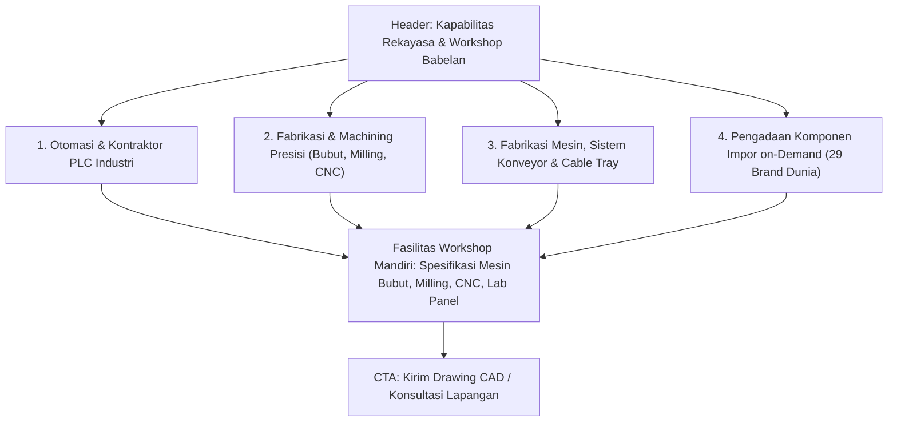

# Rencana Konten & Struktur Halaman Layanan & Workshop (Services)
**PT. Aris Teknindo Mandiri (ATM)**  
*Dokumen Blueprint: Technical Capabilities, In-House Machinery & Scope*  
*Lokasi Dokumen: `planning/services-content.md`*

---

## 1. Ikhtisar Halaman & Target Audiens
Halaman **Layanan & Workshop** bertujuan membuktikan kedalaman teknis dan kepemilikan alat fisik perusahaan kepada *Engineering Leads*, *Maintenance Managers*, dan *Production Heads*.

* **Target Pengunjung**: Manajer Pabrik, Supervisor Maintenance, Engineer Proyek yang membutuhkan kepastian:
  1. *Mesin dan proses apa saja yang dimiliki workshop ATM sendiri?*
  2. *Berapa toleransi presisi dan kapasitas dimensi pengerjaannya?*
  3. *Bagaimana standar wiring panel dan PLC yang dirancang?*
* **Tone of Voice**: Lugas, teknis, presisi, berorientasi solusi *zero-downtime*.

---

## 2. Struktur 4 Pilar Layanan Teknis

---

## 3. Rincian Teknis Tiap Pilar

### 3.1 Pilar 1: Otomasi & Kontraktor PLC Industri
* **Lingkup**: Rancang bangun panel kontrol, integrasi logic sequence PLC, inverter drive, dan layar sentuh HMI.
* **Platform PLC yang Dikuasai**: Mitsubishi (MELSEC iQ-R, Q, FX), Omron (CJ2, CP1), Allen-Bradley (ControlLogix, CompactLogix), Siemens, Delta.
* **Standar Pengerjaan**:
  * Pengkabelan terlabel rapi dengan numbering ferrule & heat shrink.
  * Uji simulasi fungsional I/O sebelum unit dikirim ke pabrik.
  * Dukungan start-up & commissioning on-site langsung di mesin.

### 3.2 Pilar 2: Fabrikasi & Machining Presisi (Workshop Mandiri)
* **Lingkup**: Pembuatan suku cadang presisi tinggi dari material baja karbon (S45C, SCM440), stainless steel (SUS304, SUS316), bronze/kuningan, aluminium, hingga POM/Teflon.
* **Daftar Produk Machining**:
  * Shaft bertingkat, Poros eksentrik, Pin pasak (dowel pin).
  * Drive sprocket, Half shaft gear, Flange hidrolik presisi.
  * Rod cylinder silinder pneumatik/hidrolik, Bushing bronze tahan aus.
  * Rekondisi komponen aus dan pelapisan hard chrome.
* **Kapasitas & Toleransi**: Pengerjaan hingga toleransi mikrometer (ISO fit h6/g6) menggunakan Bubut, Milling & CNC.

### 3.3 Pilar 3: Fabrikasi Mesin, Sistem Konveyor & Cable Tray
* **Lingkup**: Rancang bangun struktur mekanikal dan instalasi infrastruktur pabrik.
* **Komponen & Sistem**:
  * Sistem konveyor perakitan kustom (Belt, Roller, Slat, Modular).
  * *Machine Safety Guard / Enclosure* (Pelindung operator akrilik/perforated standar K3).
  * Ducting industri, tangki penampung, dan rangka baja mesin.
  * Instalasi jalur *heavy-duty cable tray* galvanis pemisah rute power dan instrumen.

### 3.4 Pilar 4: Pengadaan Komponen Impor on-Demand
* **Lingkup**: Suplai komponen otomasi, sensor, bearing presisi, dan linear motion dari 29 merek tier-1 dunia.
* **Keunggulan**: Akses rantai pasok langsung dengan jaminan part orisinil 100% dan verifikasi cepat berdasarkan *Part Number*.

---

## 4. Tabel Peralatan & Fasilitas Workshop Babelan

| Peralatan | Tipe / Spesifikasi | Kemampuan Utama |
|---|---|---|
| **Mesin Bubut (Lathe)** | Industrial Turning Center | Poros silindris bertingkat, ulir presisi metrik/inci, pin pasak, bushing |
| **Mesin Milling & Center Bor** | Vertical Milling Machine | Perataan bidang, alur pasak (*keyway*), slotting, pengeboran pusat |
| **Mesin CNC** | Digital Computer Controlled | Kontur rumit 2D/3D, repetisi tinggi untuk suku cadang otomotif |
| **Area Assembly & Uji Panel** | Electrical Testing Bay | Wiring kabel terlabel, simulasi logic PLC, uji insulasi dan grounding |

---

## 5. Alur Konversi & Call-to-Action
* Formulir RFQ Drawing CAD/PDF langsung terintegrasi.
* Direct WhatsApp ke engineer on-call (`0812 8380 895`).
